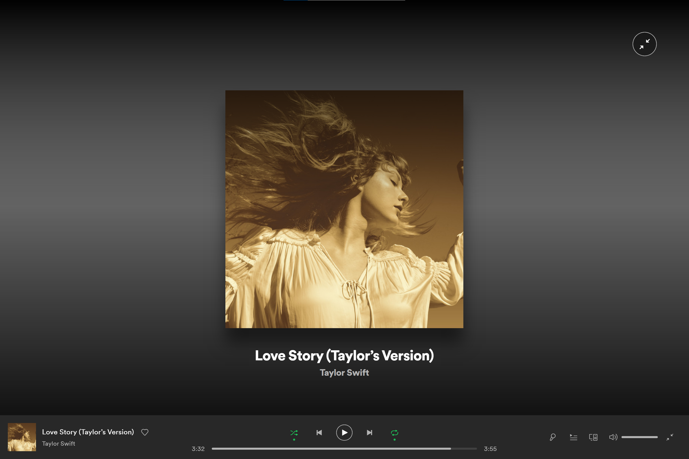
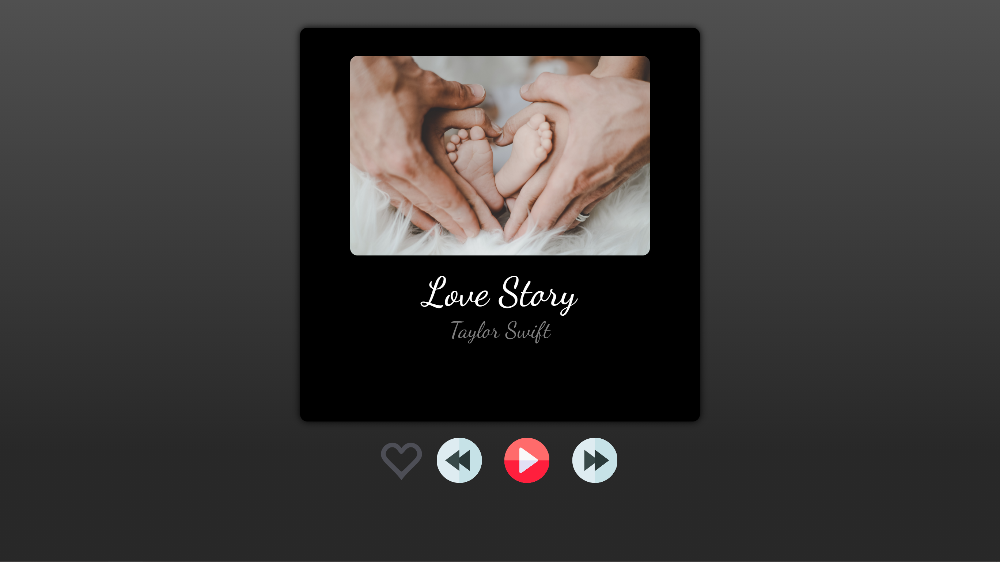

### HW1

-   作業內容: 這個作業是要你們練習⽤ HTML & CSS (only), 去把⼀個例如像是封⾯舉例的⾳樂播放器的介⾯設計刻出來，展現在⼀個網⾴上。當然，你可以找別的你喜歡的圖來當模板，甚⾄是⾃⼰畫也可以。重點是，要⽤ HTML 定義出這個「網⾴」的 elements, 然後⽤ CSS 去定義他的 styles。

-   參考圖片為: Spotify 桌面版的頁面(如下圖)
    

-   最終成果:
    為了避免侵犯肖像權，因此從公開的照片平台下載類似的圖片替代
    
    * 功能:
        1. 按下愛心(喜歡)會有動畫可以變顏色，再次按下會變回原來的圖形
        2. 把滑鼠移到黑色的區塊上會變顏色
        3. 有設計一點RWD，但僅限於視窗等比例縮放的時候
    
